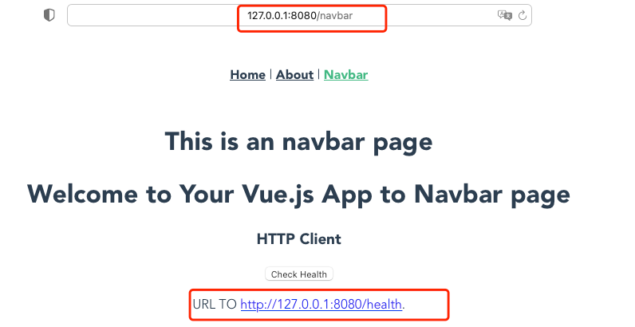
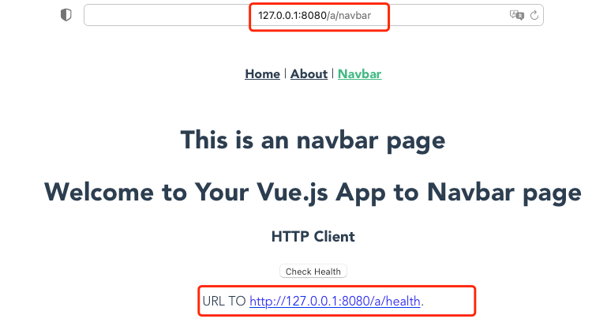
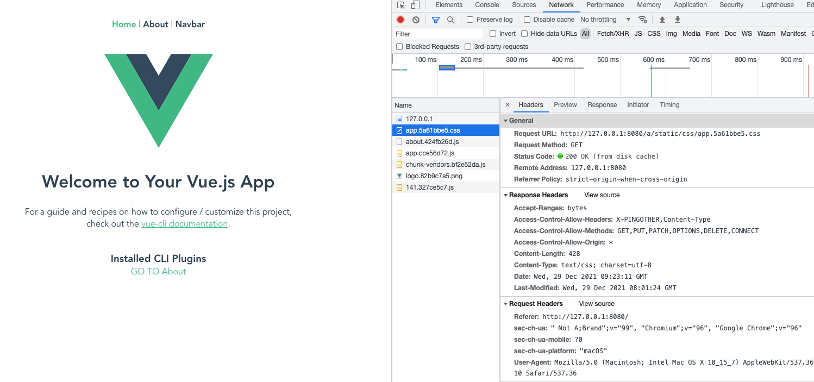

# static-server

### 静态资源动态代理

主要目的解决静态资源在变更basic路径的时需要重新编译,
这样使得上线发版的效率很低,  还需要测试。
我们只需要更改一个启动入参或者环境变量就可以动态更改路径,
不需要付出任何代价。

for example: 

1. 打包vue3.x 成dist 静态文件
```bash
cd example/vue-demo

yarn install

yarn build


```

2. 运行dist

```bash
$ http-server -f ./dist

I1229 17:18:20.321375    4825 server.go:61] Starting up http-server, serving ./dist
I1229 17:18:20.321472    4825 server.go:62] Available on:
I1229 17:18:20.321476    4825 server.go:63]    http://127.0.0.1:8080
I1229 17:18:20.321479    4825 server.go:64] Hit CTRL-C to stop the server

```

我们看看效果



现在我们试一下换一个路径例如/a

```bash
$ http-server -f ./dist --publicPath /a

I1229 17:20:52.685684    4894 server.go:61] Starting up http-server, serving ./dist
I1229 17:20:52.685791    4894 server.go:62] Available on:
I1229 17:20:52.685794    4894 server.go:63]    http://127.0.0.1:8080
I1229 17:20:52.685797    4894 server.go:64] Hit CTRL-C to stop the server

```

现在在看看, 如下图所示我们可以看到访问路径和http-client 都添加了 /a 路径静态资源也访问正常,
静态资源都添加了/a路径






## quick start

### 1. 本地安装 `http-server`


#### MacOS

```bash
# 下载 http-server
$ https://github.com/clarechu/static-server/releases/download/v0.0.4/http-server-v0.3-macos-darwin.tar.gz

# 解压http-server
$ tar -xvf http-server-v0.3-macos-darwin.tar.gz

# 配置环境变量引进http-server
```

### 使用docker 的方式

```bash
docker run -it -p 8080:8080 -v dist:/dist clarechu/http-server:v0.1.0 -f /dist --publicPath /a   
```
### 2. 前端更改代码

[README](./example/README.md)

### 参数说明

```bash
Tips  Find more information at: https://github.com/clarechu/static-server

Example:

# http-server dist .
http-server dist

# set port .
http-server dist --port 8080

# 开启页面gzip
http-server dist --port 8080 --gzip true

Usage:
  http-server [flags]
  http-server [command]

Available Commands:
  help        Help about any command
  version     Print version info

Flags:
  -p, --basicPath string    url root path (default "/")
  -f, --file string         static file path (default "./dist")
      --gzip                gzip  (default false)
  -h, --help                help for http-server
      --port int32          static file server ports (default 8080)
      --publicPath string   The base URL your application bundle will be deployed (default "/")

Use "http-server [command] --help" for more information about a command.


```